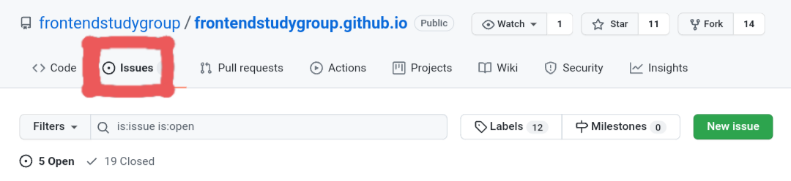
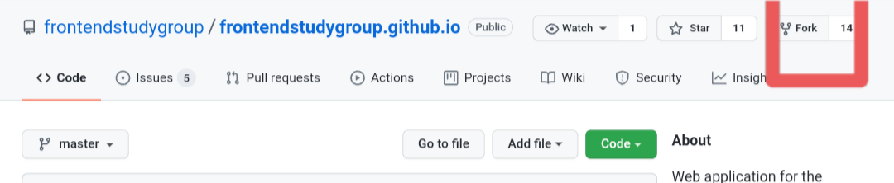
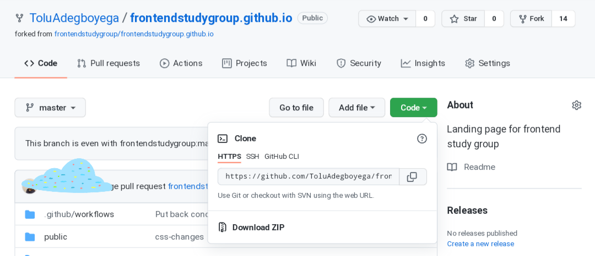
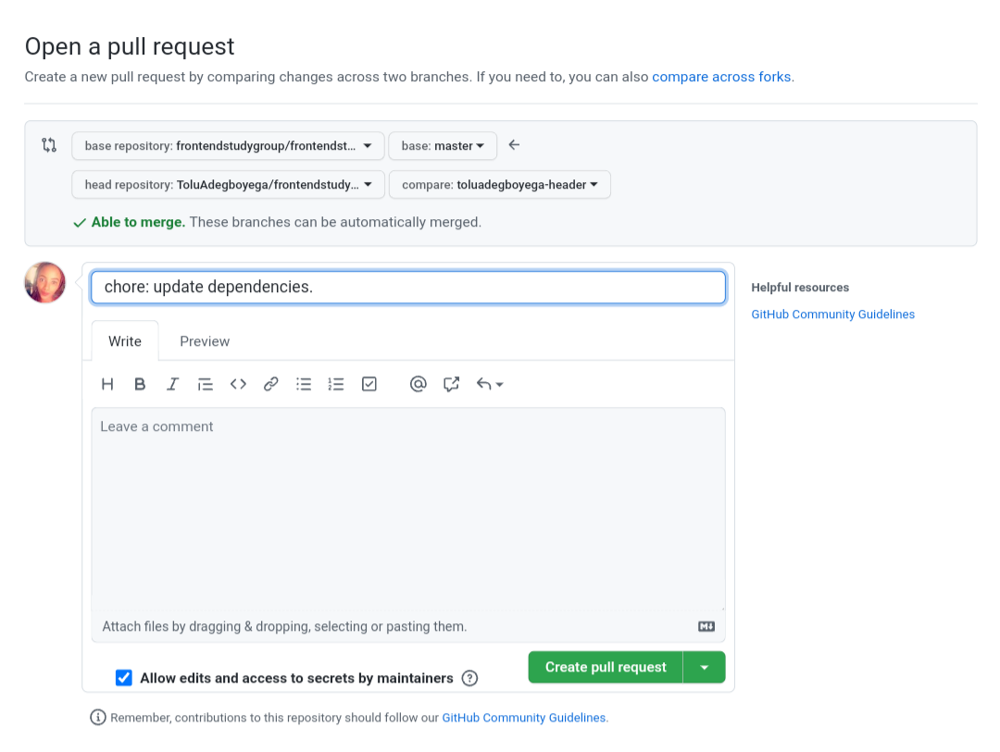

This article was originally written by [Tolu Adegboyega](https://twitter.com/ToluAdegboyega_) on her [blog](https://blog.toluadegboyega.dev/a-beginners-guide-to-open-source).

***

*Contributing to open source can be daunting for a lot of people, at least I know it was for me. Although I wanted to contribute to open source, I was not sure how to go about it. I finally took the plunge during Hacktoberfest 2021 and made my first open source contribution, and you can too.*

## What even is Open Source? 🤔

Open Source Software(OSS) is software with source code that anyone can inspect, modify, enhance and distribute under a [license](https://opensource.org/licenses/alphabetical). A lot of the technologies that we use today, such as Android, Firefox, Git, Linux, TypeScript and VLC media player are built on OSS. 

Open source code is usually developed and maintained collaboratively by a community of its users. Although the primary goal of open source projects is to create valuable and accessible open source software, it is also beneficial to its contributors. Benefits of contributing to open source include:

- Honing one's technical skills by getting the opportunity to work on real-world projects.

- Improving soft skills such as communication and giving/receiving feedback.

- Meeting new people and expanding your network. 

## …and Hacktoberfest? 🧐

Chances are that you've seen the word 'Hacktoberfest' come up a lot especially in the month of October. While contributions to open source can be made any time, Hacktoberfest is a month-long celebration of open source hosted by [DigitalOcean](https://hacktoberfest.digitalocean.com). Hacktoberfest aims to promote, celebrate and encourage people to contribute to open source. It is a great time to get started with open source contributions.

To participate, sign up on the official [Hacktoberfest](https://hacktoberfest.digitalocean.com/register)  website between October 1st and October 31st. This ensures that your contributions count. A participant has to make four(4) valid pull requests in participating GitHub or GitLab repositories. Participating repositories are labelled `hacktoberfest`, alternatively, merged pull requests can also be labelled `hacktoberfest-accepted` to participate. Once these 4 pull requests are merged into the repositories and pass the fourteen(14) day review period, a participant is eligible to win swags which include, a T-shirt and limited edition stickers or could choose to plant a tree!

## Finding Projects to Contribute To

This is where it might get a little intimidating at first as a lot of projects can seem complex. Do not fret, there are a number of ways to find projects that are of interest to you and are on your skill level to ease you in.

- ### Developer Communities

Developer communities provide a platform for developers to learn, interact, share ideas, support each other, stay up-to-date and grow. These communities can be very beneficial to starting your open source journey.

[Women Who Code Frontend](https://www.womenwhocode.com/frontend) started a dedicated study group [project](https://github.com/frontendstudygroup/frontendstudygroup.github.io) to learn about front end technologies as well as how to collaborate on an open source project. 

This was my first open source contribution.

There was an existing issue, issue #2 `Design the header`. It was just the right one as implementing an header is something I have experience working on. Per the rules of the project, I commented on the issue of my proposed plans, asked for feedback and politely requested to be assigned the issue. I soon got to work. 

Working on issue #2, not only did I learn something technically—a new css hover effect, it further reinforced to me how important communication and collaboration are, especially working with people for the first-time.

The community has been super open(pun fully intended 😏), helpful and supportive. In addition to creating the study group project, a blog has also been created and webinars organized weekly through out the month of October to discuss open source! I honestly couldn't have asked for a better first contribution as it helped boost my confidence to further participate.

- ### Social Media and Online Resources

For my second contribution, while browsing through the hacktoberfest hashtag on Twitter, I saw several tweets calling for contributors to open source repositories. I soon found one that aligned with my interest. 

Subsequent contributions have come from [goodfirstissues.com](https://goodfirstissues.com/), this is a website that aggregates beginner-friendly, open source repositories looking for help.  You can filter according to language, label and repository, making it even easier to find issues to work on. 

Other websites to find repositories to contribute to include:

- [codetriage.com](https://codetriage.com)
- [goodfirstissue.dev](https://goodfirstissue.dev) 
- [up-for-grabs.net](https://up-for-grabs.net)

- ### GitHub

GitHub is a great way to find open source projects to work on. You can take advantage of GitHub's advanced search feature and prefixes to improve your search.

Search can be filtered based on many factors such as issue label, language, number of forks and so on. Labels to search for as a beginner include `help-wanted`, `first-timers-only` or `good-first-bug`.

## Contributing to Your First Project

Contributing to open source is not limited to writing code. You can contribute by improving the documentation, opening issues, or labeling pull requests. 

Most projects will have guidelines specific to the project. These can usually be found in the `README.md` or `CONTRIBUTING.md` file. Make sure to read the whole document thoroughly and be sure that you're following guidelines that project maintainers have specified.

After choosing an open source project to work on, there are a few ways you can decide on what you would like to contribute to the project. You can work on pre-existing issues which can be found under the `Issues` tab on GitHub. 

If you find an issue that you're interested in, it is best to comment on the issue outlining how you'd go about implementing a solution. In some cases, you can ask to be assigned the issue. It is important to be polite in your communication.

You can also create a new issue based on a bug you've noticed or a feature you think needs to be 
implemented or improved upon. Keep in mind that the decision to approve your new issue is ultimately at the discretion of the project maintainer. 

Now that you've decided on an issue to work one, you can start the process of contributing.

- ### Fork the Repository

This will make a copy of the original repository. That means you can make any changes you want to the forked repository, without affecting the original one.

Once you click the `Fork` button, GitHub will redirect you to your copy of the original repo.

- ### Clone your Forked Repository

Click the `Code` button and copy the URL that's provided. 

On your local machine, run the following Git command:

    git clone https://github.com/<your_profile_name>/<repo_name>.git

This clones the repository on your machine so you can work on it. You can then open the repository in your code editor.

- ### Create a Branch

Before you start working, create a separate branch that will hold all the code that you add or edit.

You can create a branch by running the following Git command:

    git checkout -b <branch_name>

- ### Make Changes

Now you can make code changes, update the documentation, organize the files, or anything else!
All contributions are important and valuable.

- ### Commit and Push your Changes

Once you are satisfied with your code, you can commit and push your changes to GitHub.

    git add .
    git commit -m 'commit message'
    git push -u origin <your_branch_name>

- ### Create a Pull Request

Click on the `New pull request` button under the `Pull requests` tab in your forked repository on the GitHub. GitHub will automatically compare your changes to the original repository. You will also be shown a text editor. Fill this in with the relevant information needed to understand the work you've just done. Click the `Create pull request` button. 

Voila! You have made changes and just created a pull request. 👏🏾

- ### What Next?

Wait for the project maintainer(s) to review your changes. Upon review, you may be requested to make changes to the work you've done. If all goes well, your pull request will be approved and the project maintainer(s) will merge your contributions into the codebase. You'll officially become an open source contributor! 🎉

## Conclusion

Open source contribution for me has been an amazing and rewarding learning experience. I hope this post helps to give a better understanding of open source and inspires you to get involved. It might take a few tries to fully put your skills to use, but there is a place for everyone willing to contribute to open source. 
