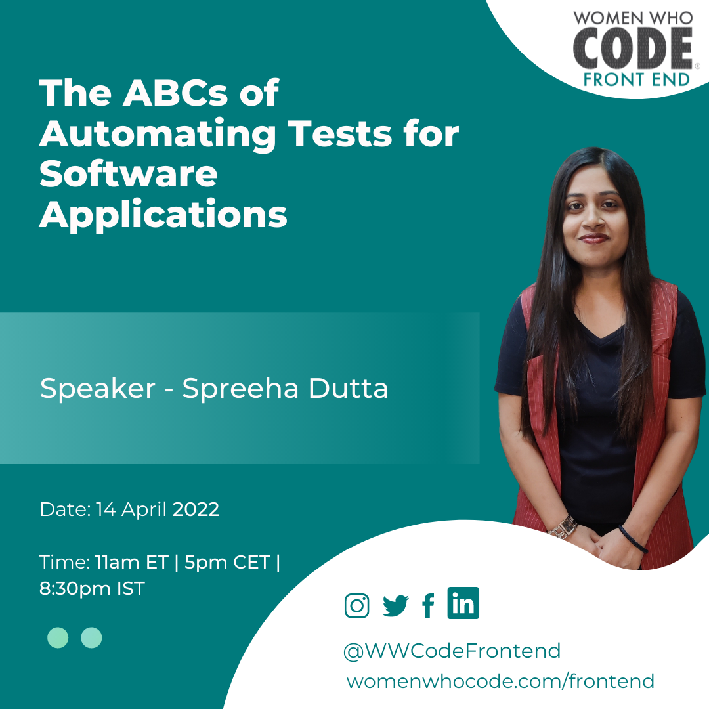

<iframe width="560" height="315" src="https://www.youtube.com/embed/3e9EjdlsGZE" title="YouTube video player" frameborder="0" allow="accelerometer; autoplay; clipboard-write; encrypted-media; gyroscope; picture-in-picture" allowfullscreen></iframe>

## The ABCs of Automating Tests for Software Applications

In this session Spreeha Dutta will talk about how to identify which test scenarios to automate in a software application, writing test scripts and automating test scenarios.

## Spreeha Dutta

A software engineer, blogger and podcaster who is dedicated in the building of a technically sound society.

[Registration Link](https://us02web.zoom.us/webinar/register/WN_jrH7ApmGSrW6VxvTP9ZbNg)