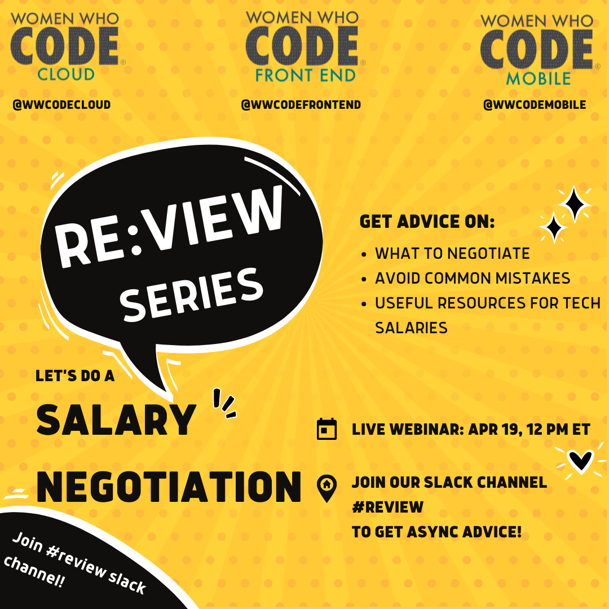

<iframe width="560" height="315" src="https://www.youtube.com/embed/ebgJQWIMSAo" title="YouTube video player" frameborder="0" allow="accelerometer; autoplay; clipboard-write; encrypted-media; gyroscope; picture-in-picture" allowfullscreen></iframe>

## Resources

- [Salary negotiation by Princiya Sequeira](https://princiya.com/blog/tags/salary/)
- [Videos from the WWCode community](https://www.youtube.com/c/WomenWhoCodeGlobal/search?query=salary%20&mc_cid=b7f770e744&mc_eid=d3895f688f)
- [Annual Equal Pay Report](https://www.womenwhocode.com/blog/world-s-largest-women-in-tech-organization-releases-annual-equal-pay-report?mc_cid=b7f770e744&mc_eid=d3895f688f)
- [Maximize your job offer as a remote engineer](https://leaddev.com/career-paths-progression-promotion/how-maximize-your-job-offer-remote-engineer)
- [How to negotiate a raise and get paid what you're worth](https://twitter.com/dklineii/status/1513863527441784839)
- [How to provide your desired salary](https://elpha.com/resources/desired-salary)
- [Equity for software engineers](https://blog.pragmaticengineer.com/equity-for-software-engineers/)

## Salary data

- Europe only (for now) [TechPays](https://techpays.com/europe/germany)
- [Levels.fyi](https://www.levels.fyi/)

## Event details

Registration: [https://us02web.zoom.us/meeting/register/tZYodOGhqz8jEtQezwwS3SFcwPBn90Z68xCa)

Hello everyone,

WWCodeCloud, WWCodeFrontend, and WWCodeMobile tracks would like to invite you all for a salary negotiation session. Join our slack channels (see links below) to get async advice and join our webinar on April 19, 2022, at 12 pm ET to get 1:1 advice on salary negotiations.

Get advice on what to negotiate, how to avoid common mistakes, and useful resources for tech salaries. You can also ask us your own set of questions on this topic!

Live webinar: April 19, 2022 at 12 pm ET.
Async advice on our slack community through the '#review' channel.

Join our slack community:
Frontend: https://join.slack.com/t/womenwhocodefrontend/shared_invite/zt-gaic5y90-pDJK4H_NbObZ_MU_rcYc0A
Cloud: https://join.slack.com/t/wwcodecloud/shared_invite/zt-lngnes83-iq8TuBLOtAGXnHFaM5~sTw
Mobile: https://join.slack.com/t/wwcodemobile/shared_invite/zt-gimc0cn4-eHL6YAerU30bC2nYyNtyYA

Questions/Suggestions:
frontend@womenwhocode.com,
cloud@womenwhocode.com
mobile@womenwhocode.com

Join the conversation on Twitter/Instagram/Facebook/LinkedIn: @WWCodeFrontEnd / @WWCodeCloud / @WWCodeMobile

Become a member:
https://www.womenwhocode.com/frontend, https://www.womenwhocode.com/cloud, https://www.womenwhocode.com/mobile

About Women Who Code: WWCode is the largest and most active community of technical women in the world. Our mission is to inspire women to excel in technology careers. We have 290,000 members in 134 countries & counting. Join our community by visiting womenwhocode.com and sign up to become a member.