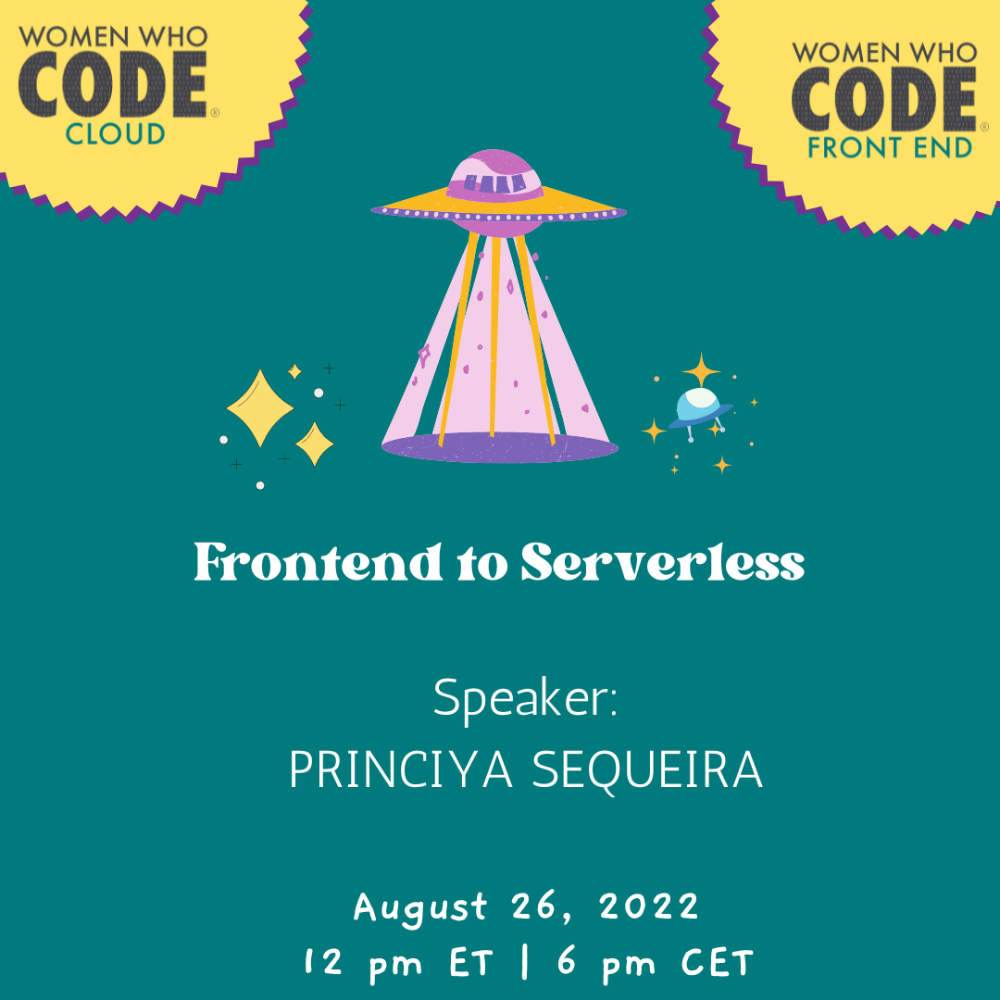

## Frontend to Serverless

You have built your awesome web application and now you want to share it with the world! Where do you start? How do you get code from your machine to the cloud? In this webinar, you will learn how to develop a web application locally and set it up for cloud deployment. You will also learn about Serverless functions and how you can amplify your web development skills!

[Registration Link](https://us02web.zoom.us/webinar/register/WN_zc_otnBRRCut0A7lUYZP9Q)

## Princiya Sequeira

Princiya Sequeira has a dozen years of experience building full-stack web & mobile apps, implementing CI/CD solutions, supporting infrastructures, and leading technical teams. Princiya is a WWCode Leadership Fellow and an Engineering Manager at Anaconda.