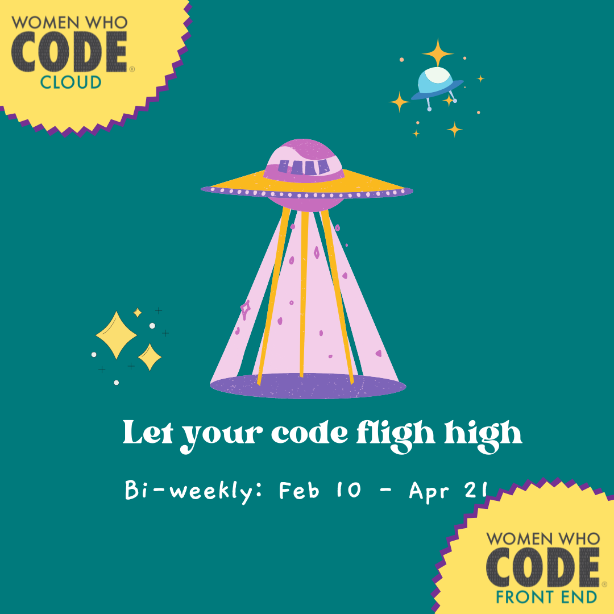
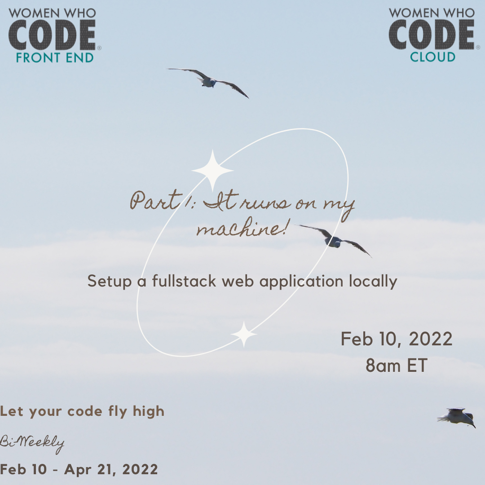

## Let your code fly high

You have built your awesome web application and now you want to share it with the world! Where do you start? How do you get code from your machine to the cloud?

In this biweekly workshop series, Feb 10 - Apr 21, 2022, we will teach you how to develop a web application locally and set it up for cloud deployment including AWS and Azure using principles of Infrastructure as Code, Continuous Integration, and Continuous Delivery.

Speaker & Short Bio
Sunitha Patel, Xiaoli Shen

## Part 1 - It runs on my machine

In the part 1 of this workshop series you will learn to setup a fullstack web application that runs locally on your machine.

[Registration Link](https://us02web.zoom.us/webinar/register/WN_zPKlek8YQzGlCVVap8mUsw)