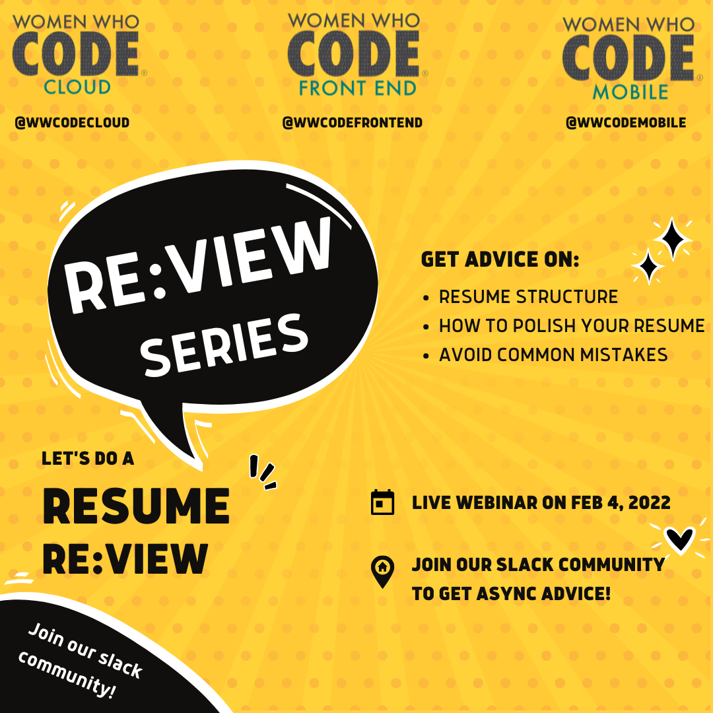

Registration: [https://us02web.zoom.us/webinar/register/WN_MzIIccyPSU6YqPBWr2r_dQ](https://us02web.zoom.us/webinar/register/WN_MzIIccyPSU6YqPBWr2r_dQ)

Hello everyone,

WWCodeCloud, WWCodeFrontend, and WWCodeMobile tracks would like to invite you all for a resume review session. Join our slack channels (see links below) to get your resume reviewed async or join our webinar on Feb 4, 2022 at 12 pm ET to get 1:1 advice about your resume.

Get advice on the resume structure, how to polish it, and avoid common mistakes. You can also ask us your own set of questions on this topic!

> Live webinar: Feb 4, 2022 at 12 pm ET.

> Async advice on our slack community through the 'resume-review' channel.

Join our slack community:
Frontend: https://join.slack.com/t/womenwhocodefrontend/shared_invite/zt-gaic5y90-pDJK4H_NbObZ_MU_rcYc0A
Cloud: https://join.slack.com/t/wwcodecloud/shared_invite/zt-lngnes83-iq8TuBLOtAGXnHFaM5~sTw
Mobile: https://join.slack.com/t/wwcodemobile/shared_invite/zt-gimc0cn4-eHL6YAerU30bC2nYyNtyYA

Questions/Suggestions: 
frontend@womenwhocode.com,
cloud@womenwhocode.com
mobile@womenwhocode.com

Join the conversation on Twitter/Instagram/Facebook/LinkedIn: @WWCodeFrontEnd / @WWCodeCloud / @WWCodeMobile

Become a member: 
https://www.womenwhocode.com/frontend, https://www.womenwhocode.com/cloud, https://www.womenwhocode.com/mobile

About Women Who Code: WWCode is the largest and most active community of technical women in the world. Our mission is to inspire women to excel in technology careers. We have 290,000 members in 134 countries & counting. Join our community by visiting womenwhocode.com and sign up to become a member.