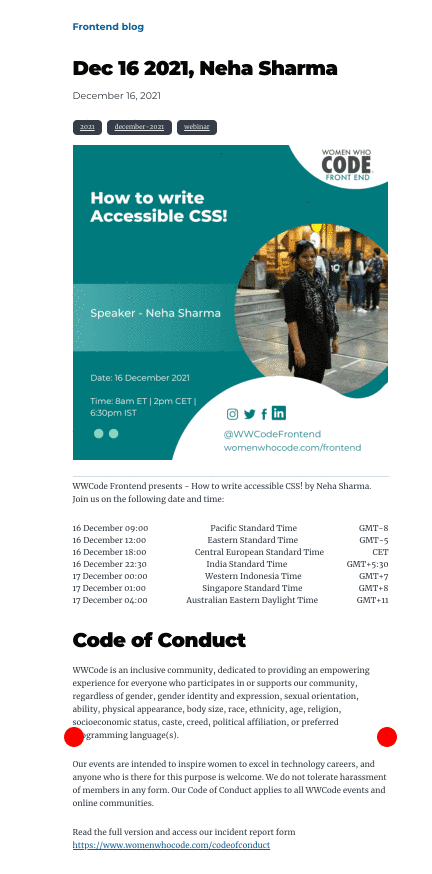

We are never too old to set another goal or to dream a new dream! WWCode Frontend wishes you all a great 2022 ahead.
Stay happy and healthy! 🎉 ✨

We have been planning on events and content for 2022, and we cannot wait to share with you all.

## 2021 Highlights

- WWCode Frontend technical track has neared 3000 members! We are growing in numbers and engagement on social media too.
- We had a great [Hacktoberfest studygroup event](/tags/hacktoberfest) and [chat show series](https://www.youtube.com/watch?v=yfL0Q83beNI&list=PLVcEZG2JPVhdJVopX9jAM8PUCaC7qKOgp&index=54).

## Improvements

During the holiday break I was looking into what tasks can be automated. While organising events we do lot of manual and repetitive tasks. I took the first step in avoiding redundancy. I have created a template to upload events going forward once we have confirmation from the speaker. The blog post will include the following:

- Event graphics
- Event date and time in various timezones! I have used `date-fns` to generate time in various timezones. Please create a [pull request against this repository](https://github.com/frontendstudygroup/blog/blob/master/src/components/dateTime.js#L9) if your preferred timezone is missing!
- Includes code of conduct and any other relevant information which otherwise we would have to create separate slides during the event. The carousel component for the slides is a custom component written from scratch. The source code can be found [here](https://github.com/frontendstudygroup/blog/tree/master/src/components/carousel).
- I also added tags to the content. All tags are [here](/tags).

## Links

- [Website](https://www.womenwhocode.com/frontend)
- [Slack](https://join.slack.com/t/womenwhocodefrontend/shared_invite/zt-gaic5y90-pDJK4H_NbObZ_MU_rcYc0A)
- [Github](https://github.com/frontendstudygroup)
- [Facebook](https://www.facebook.com/WomenWhoCodeFrontEnd)
- [Instagram](https://www.instagram.com/wwcodefrontend1/)
- [Linkedin](https://www.linkedin.com/showcase/women-who-code-front-end/)
- [Twitter](https://twitter.com/WWCodeFrontEnd)
- [Youtube playlist](https://www.youtube.com/playlist?list=PLVcEZG2JPVhdJVopX9jAM8PUCaC7qKOgp)
- [CFP Link](https://wwcode.typeform.com/applytospeak)

