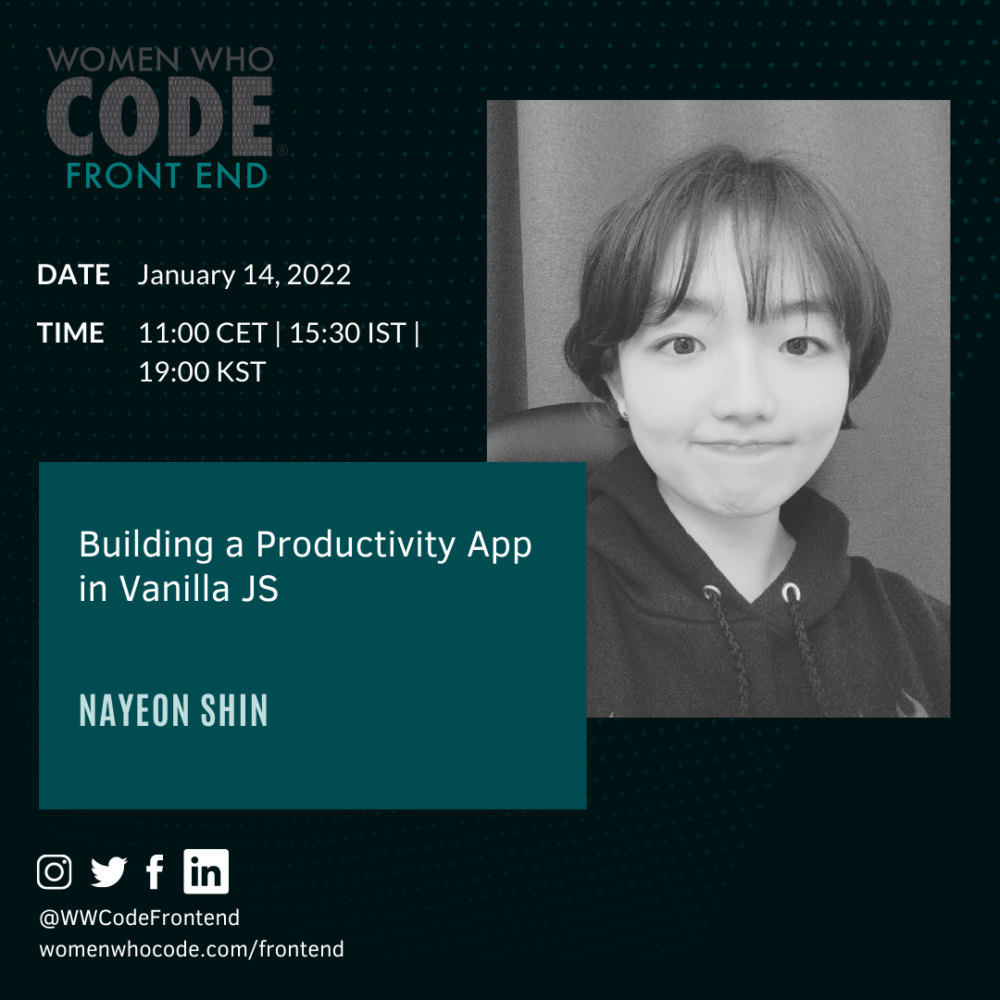
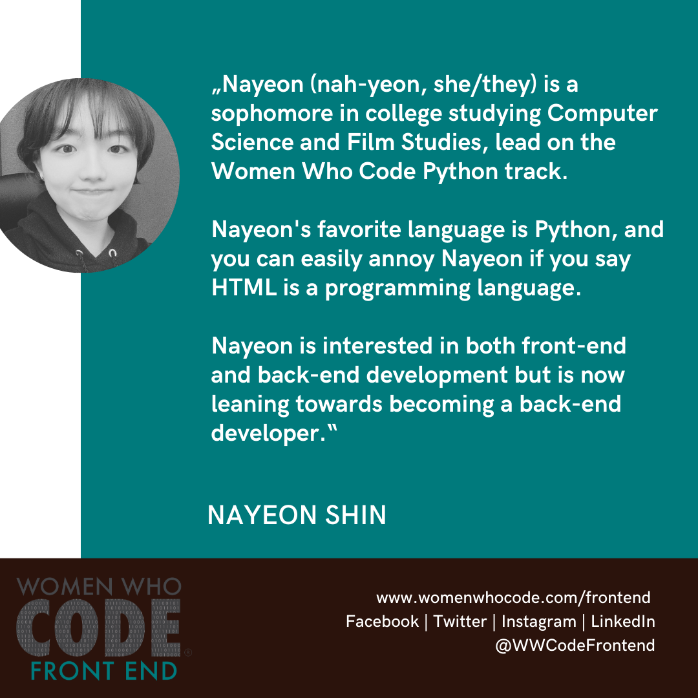

## Building a Productivity App in Vanilla JS

Join us on January 14, 2022 at 11:00 CET | 15:30 IST | 19:00 KST for a session from Nayeon Shin on "Building Productivity App in Vanilla JS".

[Registration Link](https://us02web.zoom.us/webinar/register/WN_zab28bHiRCqahjZxNgs3PA)

[Momentum](https://bit.ly/3FLaUlZ) is a Chrome extension that's a productivity tool.
Its main features include:
- Greeting users by their name
- Displaying the current clock and weather
- Letting users make a to-do list.

But it comes with many limited features if you're not paying $3.33/month to use the premium version. So I decided to make my own to take full advantage of such a productivity tool freely. (https://your-haru.netlify.app/)
In this workshop, I will introduce how I created and deployed from scratch a static single page application (SPA) in HTML/CSS/Vanilla JS only. We will look into the bits and pieces of this project and learn topics such as: implementing fade in/out animations, leveraging local storage not to lose data on refresh,and hiding an API key using Netlify.

This is not an interactive session where attendees will code with the speaker. The prerequisites are the basic understanding of HTML, CSS, and JavaScript

## Nayeon Shin

Nayeon (nah-yeon, she/they) is a sophomore in college studying Computer Science and Film Studies, lead on the Women Who Code Python track. Nayeon's favorite language is Python, and you can easily annoy Nayeon if you say HTML is a programming language. Nayeon is interested in both front-end and back-end development but is now leaning towards becoming a back-end developer.

<iframe width="560" height="315" src="https://www.youtube.com/embed/IrbO9OoOIK0" title="YouTube video player" frameborder="0" allow="accelerometer; autoplay; clipboard-write; encrypted-media; gyroscope; picture-in-picture" allowfullscreen></iframe>

