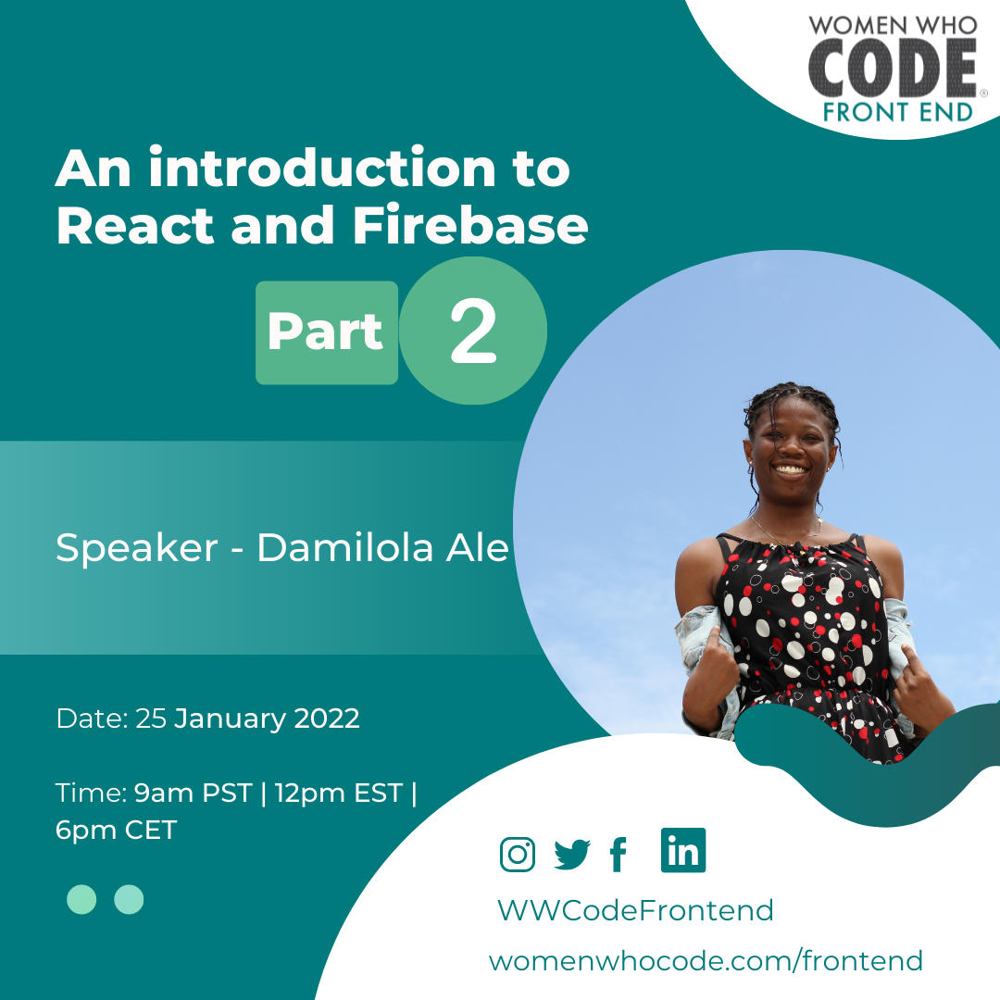

## An introduction to React and Firebase - Part 2

Join us on January 25, 2022 at 12:00 EST | 18:00 CET | 22:30 IST for a session from Damilola Ale on "An introduction to React and Firebase - Part 2".

[Registration Link](https://us02web.zoom.us/webinar/register/WN_xcGUc1xBTK-v-de_rr7RFw)

WWCode Frontend presents - "An introduction to React and Firebase - Part 2" where attendees would learn how to build a simple authentication app with React and Firebase as the backend.

You can find [Part - 1 here.](../jan-18-damilola-ale)

## Damilola Ale

Damilola is a frontend Engineer at Evolve Credit.

She loves building and designing frontend applications and desires to be a UX Engineer. She loves reading, and creative planning. She also loves to teach.

<iframe width="560" height="315" src="https://www.youtube.com/embed/As_yUt3z-4Q" title="YouTube video player" frameborder="0" allow="accelerometer; autoplay; clipboard-write; encrypted-media; gyroscope; picture-in-picture" allowfullscreen></iframe>

