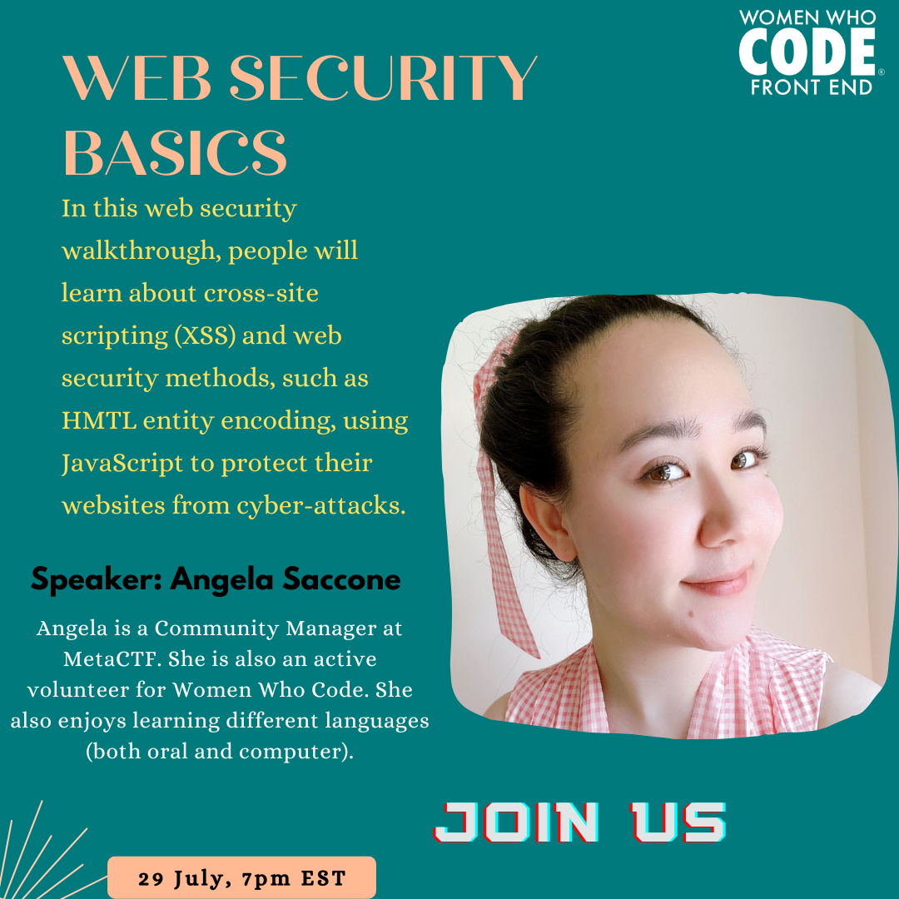

<iframe width="560" height="315" src="https://www.youtube.com/embed/eNxy56vet8M" title="YouTube video player" frameborder="0" allow="accelerometer; autoplay; clipboard-write; encrypted-media; gyroscope; picture-in-picture" allowfullscreen></iframe>

In this web security walkthrough, people will learn about cross-site scripting (XSS) and web security methods, such as HMTL entity encoding, using JavaScript to protect their websites from cyber-attacks.

Registration link:  https://us02web.zoom.us/webinar/register/WN_5hip_DofSjiFptWJNm5Bug

Join our slack community:
https://join.slack.com/t/womenwhocodefrontend/shared_invite/zt-gaic5y90-pDJK4H_NbObZ_MU_rcYc0A

## About Angela Saccone
Angela is a Community Manager at MetaCTF. She is also an active volunteer for Women Who Code. She also enjoys learning different languages (both oral and computer)
