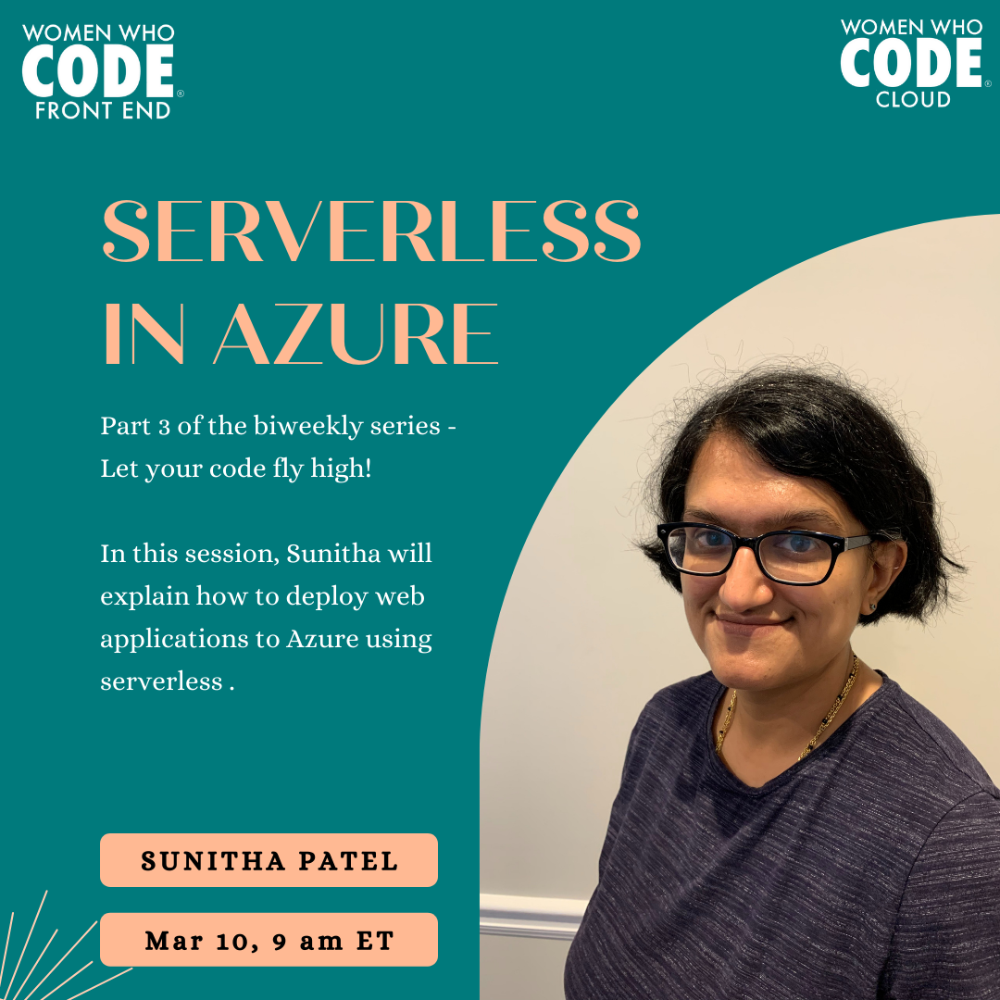

<iframe width="560" height="315" src="https://www.youtube.com/embed/8wKy1COljxk" title="YouTube video player" frameborder="0" allow="accelerometer; autoplay; clipboard-write; encrypted-media; gyroscope; picture-in-picture" allowfullscreen></iframe>

## Let your code fly high

You have built your awesome web application and now you want to share it with the world! Where do you start? How do you get code from your machine to the cloud?

In this biweekly workshop series, Feb 10 - Apr 21, 2022, we will teach you how to develop a web application locally and set it up for cloud deployment including AWS and Azure using principles of Infrastructure as Code, Continuous Integration, and Continuous Delivery.

Speaker & Short Bio
Sunitha Patel, Xiaoli Shen

## Part 3 - Serverless in Azure

In the part 3 of this workshop series Sunitha Patel will explain how to deploy web applications to Azure using serverless. API will become an Azure Function and we will use Azure Static Web Apps to host it in Azure.

## Sunitha Patel

Sunitha Patel is a software engineer with over 15 years of experience in full stack development with C#, Angular and Azure, currently working with Ruby on Rails at Shopify.

[Registration Link](https://us02web.zoom.us/meeting/register/tZIqfuyprjgtG9VyTTFZbcyPYvS01EXSsLm3)