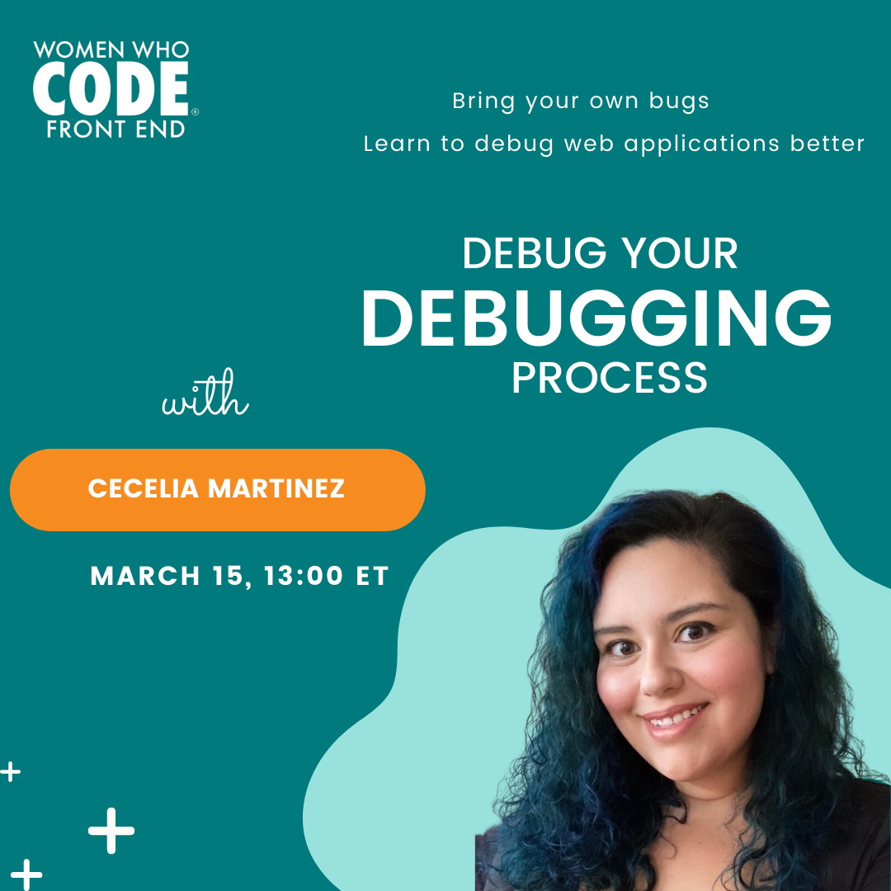

## Debug your debugging process

Join us on March 15, 2022 at 13:00 ET for a session from Cecelia Martinez on "Debug your debugging process". Bring your own bugs and learn to debug web applications better.

[Registration Link](https://us02web.zoom.us/meeting/register/tZIpf-qtqDIoHdNL6gTd7oV35LUlOxC6lItE)

This event is BYOB (Bring Your Own Bugs!).

Investigating and fixing bugs in your application can feel like a frustrating and daunting process.  With the right approach, debugging can actually help you better understand you codebase and be more confident to fix bugs fast. We'll cover debugging best practices and debug some issues together live! Submit your GitHub issues in advance in `#byob` slack channel to have your issue reviewed during the webinar.

Join our slack channel: [https://join.slack.com/t/womenwhocodefrontend/shared_invite/zt-gaic5y90-pDJK4H_NbObZ_MU_rcYc0A](https://join.slack.com/t/womenwhocodefrontend/shared_invite/zt-gaic5y90-pDJK4H_NbObZ_MU_rcYc0A)

Find us on [social media](https://beacons.ai/wwcodefrontend)

## Cecelia Martinez

Cecelia is dedicated to building developer communities that are inclusive, constructive, and make software development a better experience for all. Her role as Community Lead at Replay.io involves coding, writing, speaking, teaching, and most importantly listening. She is a lead volunteer with Women Who Code FrontEnd, chapter head of Out in Tech Atlanta, a mentor, and part of the GitHub Stars program.

