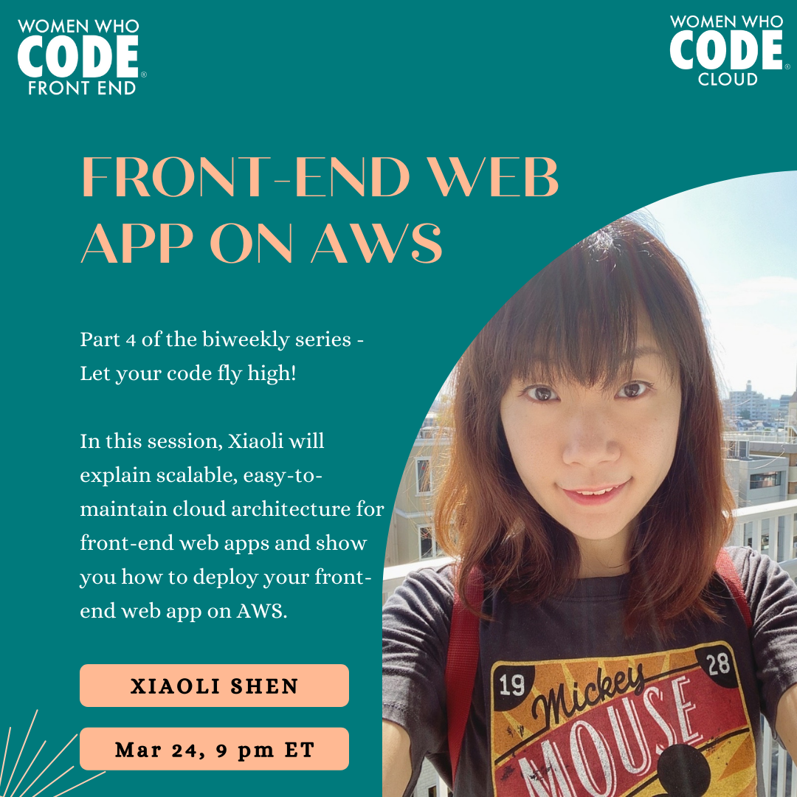

## Let your code fly high

You have built your awesome web application and now you want to share it with the world! Where do you start? How do you get code from your machine to the cloud?

In this biweekly workshop series, Feb 10 - Apr 21, 2022, we will teach you how to develop a web application locally and set it up for cloud deployment including AWS and Azure using principles of Infrastructure as Code, Continuous Integration, and Continuous Delivery.

Speaker & Short Bio
Sunitha Patel, Xiaoli Shen

## Part 4 - Frontend web app on AWS

In this session, Xiaoli will explain scalable, easy-to-maintain cloud architecture for front-end web apps and show you how to deploy your front-end web app on AWS. Follow along to gain hands-on experience!

This session covers Amplify / S3 + Cloudfront (two possibilities for front end deployment on AWS).

If you'd like to follow along, it is best to create an AWS account and we'd generally stay within the free tier. However, we can also provide temporary AWS environment to use during the session. Please let us know in advance if you need one.

## Xiaoli Shen

Solutions architect at AWS. Formerly a tech lead and senior full stack engineer building large-scale systems on the cloud.

[Registration Link](https://us02web.zoom.us/meeting/register/tZIqfuyprjgtG9VyTTFZbcyPYvS01EXSsLm3)