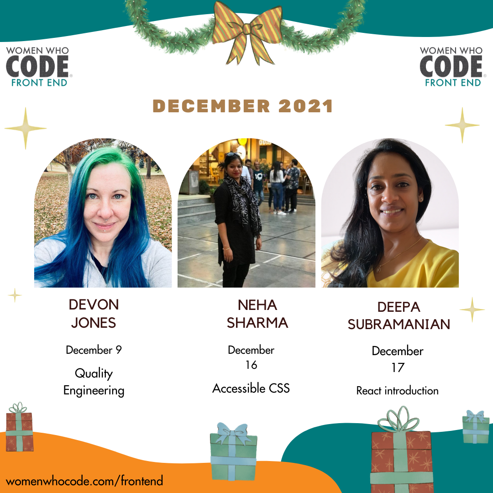

We had a blast in October 2021 with the Hacktoberfest chat show series and the study group. For a first timer, this event was a success.

I, [Princiya Sequeira](https://princiya.com/blog/thankful/#time-management), also realised that I could not continue at this pace alone and decided to pause events for the WWCode Frontend track for November 2021 and focus on onboarding volunteers.

## Volunteer management

While most of November went talking to new and old volunteers, understanding their motivations, it also became clear that onboarding volunteers takes much longer time than anticipated. As leadership fellows we work around ~10 hours/week and within this time it is extremely difficult to do everything. Volunteer management and event management are two full time job roles and hence I decided to onboard volunteers passively, give them time to figure out what they are interested in. Volunteers also need to be nurtured, mentored and groomed so that they can do their volunteering activities. Timezone differences is another challenge. Also given the upcoming December holiday season I also noticed that volunteers could not commit yet and hence it made sense to give them time and space to let them explore and get back to me about what they want to do. Currently, we have few volunteers who are working in the background and we will announce and promote them in January 2022!

## DSA study group

DSA study group did not work like expected and we have paused this for now!

## Social media activities

We have 2 volunteers, Kaleigh Scruggs and Faith Pueneh looking after wednesday motivation and friday feelings posts. We will announce them in January 2022.

## Event management

Event line up for December 2021.

## Conclusion

I completed 3 months as a leadership fellow and I wrote my reflections in this [post](https://princiya.com/blog/thankful/).

Overall I am happy and I am looking forward to 2022 as we have been chalking out several new ideas and initiatives.

