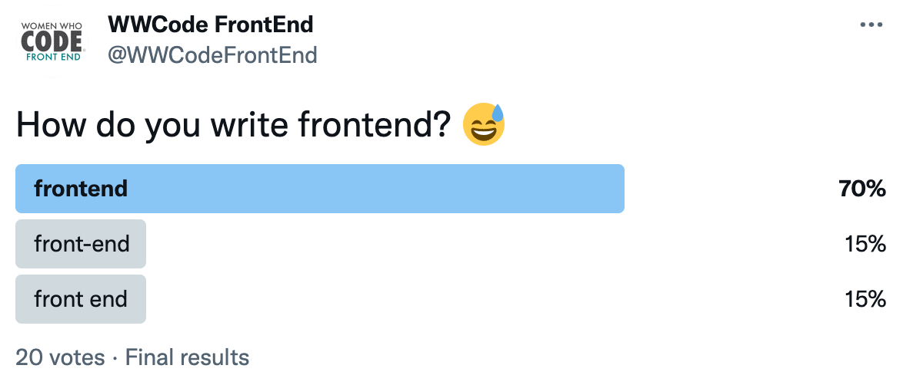

In the [previous issue](../newsletter-issue-1/) we (or just me?) learned about a serverless React application and deployed it into Netlify. Today we will learn how to make the serverless apps stateful.

## One new thing to learn this week - Database and serverless functions!

[Here](https://princiya.com/blog/serverless-react/#overview-of-databases-for-serverless-functions) is an overview of databases for serverless functions.

I extended the [simple serverless app](https://princiya.com/blog/serverless-react/), which I had created earlier this month, to connect to [Supabase](https://supabase.com/) database. This was my first time using Backend as a service and I chose Supabase.

I followed [this tutorial post](https://www.netlify.com/blog/2021/06/28/saving-data-to-supabase-and-getting-it-back-again/) to read and save items using Supabase.

### Three questions to ponder

- Why is it important to make serverless functions stateful? What happens if serverless functions are stateless?
- What problems do "Database as a service" providers solve as opposed to traditional databases? When did "Database as a service" come into practice?
- How is the serverless architecture?

Join our slack channel and we can ponder over these questions together: [https://join.slack.com/t/womenwhocodefrontend/shared_invite/zt-gaic5y90-pDJK4H_NbObZ_MU_rcYc0A](https://join.slack.com/t/womenwhocodefrontend/shared_invite/zt-gaic5y90-pDJK4H_NbObZ_MU_rcYc0A)

## Community showcase

- [Nayeon Shin - Building a productivity app in Vanilla JS](../jan-14-nayeon-shin/)
- [Damilola Ale - An introduction to React and Firebase](../jan-18-damilola-ale/)
- [Farhana - A Mental Health Journey as a Software Engineer](https://dev.to/farhanaxmustafa/a-mental-health-journey-as-a-software-engineer-g48)
- [Princiya Sequeira - Serverless React](https://princiya.com/blog/serverless-react/)
- Question from the community: [Is Docker, Kubernetes necessary for frontend development](https://princiya.com/blog/docker-k8s-for-frontend/)
- Advice for the community: [How to learn](https://princiya.com/blog/how-to-learn)

## For Fun

We conducted this poll on Twitter!

