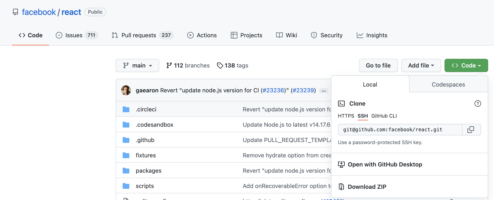
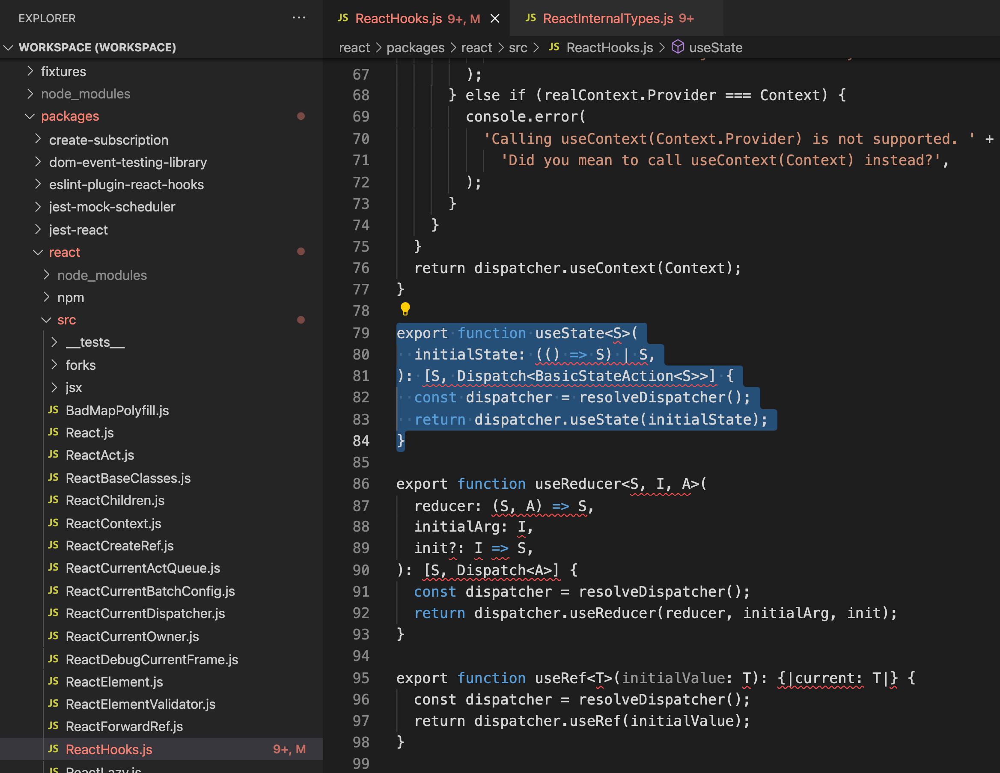
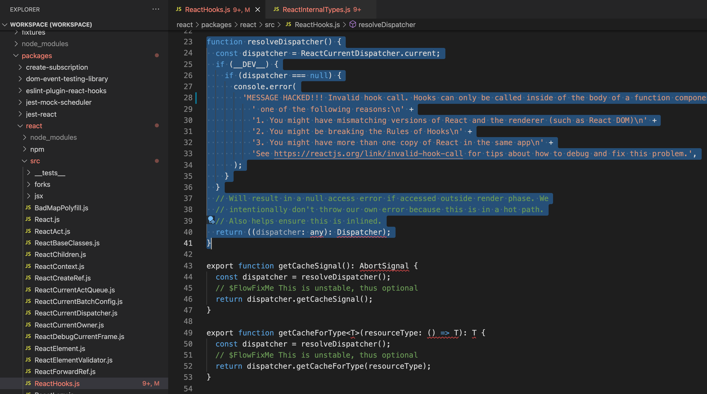
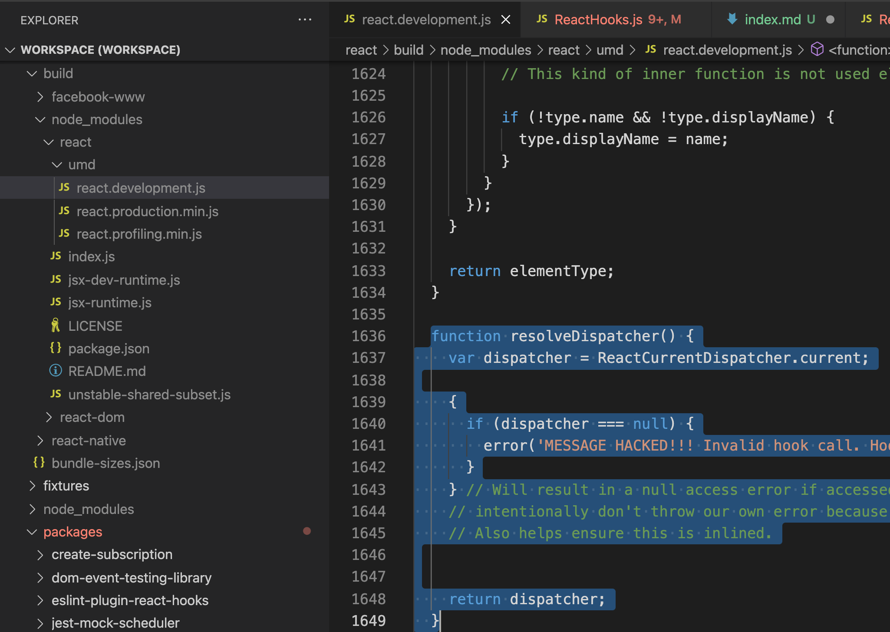

In recognition of FOSS February, we will focus on opensource topics to learn for this month!

We did a [Hacktoberfest themed studygroup in October 2021](../tags/opensource) which was well received within our community.

In this "What to learn" issue, we will learn how to contribute to React core. This way you will get a rough idea how to contribute to any opensource project and also learn alongside architecture, design patterns concerning some of the popular opensource projects.

## One new thing to learn this week - How to contribute to React core!

Step 1. Clone the `react` project.



Step 2. Locate the source code for `hooks`. It is at `react/packages/react/scr/ReactHooks.js`.

[Here](https://reactjs.org/docs/codebase-overview.html) is the codebase overview in detail for the React code.

```
export function useState<S>(
  initialState: (() => S) | S,
): [S, Dispatch<BasicStateAction<S>>] {
  const dispatcher = resolveDispatcher();
  return dispatcher.useState(initialState);
}
```



Step 3. Change the error message in the `resolveDispatcher` function. I have added `MESSAGE HACKED` to the existing hooks error message.



Step 4. Build your changes.

[Here](https://reactjs.org/docs/how-to-contribute.html#development-workflow) is a detailed overview about how to build your React code so that you can test your changes locally.

If this is the first time you cloned the React project then run `yarn` to install all packages. After updating the error message run the following to build your changes - `yarn build react/index,react-dom/index --type=UMD`.

Step 5. Try the above changes in your existing React project.

I used the [existing React project](../newsletter-issue-2) from last month's serverless React application.

Within the existing React application, I copied the `build/node_modules/react/umd/react.development.js` file from the previous build step (step 4) and pasted under `<existing project>/node_modules/react/umd/react.development.js`.

The updated error message from step 4 does exist in this copied file.



Step 6. 😭 When I ran the existing serverless React application, I did not get the hacked error message! 😭

### Three questions to ponder

- What did I do wrong and why could I not get an updated error message?
- What is the architecture for React Hooks? [Here](https://www.the-guild.dev/blog/react-hooks-system) is a good explanation, might be a little old but a good read.
- In the context of this example and screenshots, what is umd vs cjs?

Join our slack channel and we can ponder over these questions together: [https://join.slack.com/t/womenwhocodefrontend/shared_invite/zt-gaic5y90-pDJK4H_NbObZ_MU_rcYc0A](https://join.slack.com/t/womenwhocodefrontend/shared_invite/zt-gaic5y90-pDJK4H_NbObZ_MU_rcYc0A)


