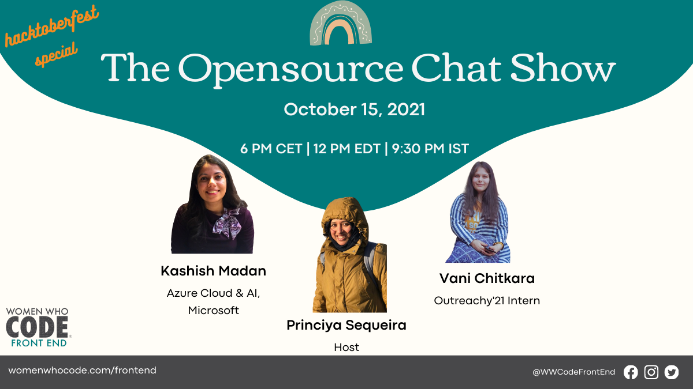

## Opensource study group

- We kicked off the opensource study group for [WWCode Frontend](https://womenwhocode.com/frontend) on October 1, 2021.
- Since then we have had 25 pull requests merged and the community engagement has been great. ~10 pull requests merged during the second week. 🎉
- [Here](https://github.com/frontendstudygroup) are the repositories for contributions.

### Study group observations

- I am overall happy with the outcome of the study group itself. Week 1 was busy, since this was a new thing, folks were excited and the "getting into" phase was relatively easy.
- Over the weeks lot of pull requests got merged and this was a good collaboration for folks learning opensource for the first time, understand how things work and also how to take up different things and work in parallel together with others.

### Study group #applaud-her ✨

- To everyone who contributed to the studygroup repositories - both code and blog.

## The opensource chat show - Episode 2 and Episode 3

[Youtube Hacktoberfest 2021 playlist](https://www.youtube.com/playlist?list=PLVcEZG2JPVhdikCnEeGTOcRNzE28-k-_E)

In the first episode we discussed tips on how to make the most out of your opensource contributions, why it is important to have a motivation which will in turn help you better decide what you want to do and also how to be a little selfish in choosing what you want to do with opensource.

In the 2nd episode we discussed tips about how to pick an opensource project itself, not to be overwhelmed and also learned about opensource licenses. The key message from our speakers was that opensource is for everyone, and not to restrict yourself. Patience is the key, sky is the limit!

In the 3rd episode of the opensource chat show we spoke in particular about the different types of opensource contributions you can make, which are not just limited to writing code. Both our speakers had lot of useful insights to share about their opensource journeys and how they contributed to opensource in various ways.

We wrapped up another great 4th episode of the chat show on October 22, 2021. We heard more insightful and exciting stories and speakers had great advice for first time contributors and how to work better in a remote setup and with remote timezones. The video recording will be uploaded into Youtube shortly. Stay tuned or follow our blog updates...

## What's next?

October 29, 2021 will be the wrap up episode for the opensource chat show. We will also feature a special guest who works at the OSPO (open source program office) team at Microsoft!

[Registration link](https://us02web.zoom.us/webinar/register/WN_0i4q_-RxRnGyr3t_uD_XXw)

Check out all our upcoming events [here](https://www.womenwhocode.com/frontend/events)

